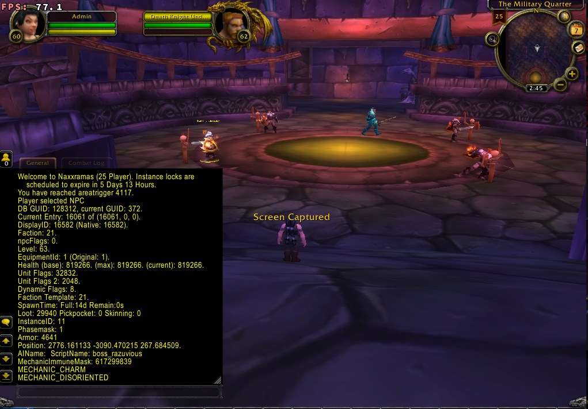
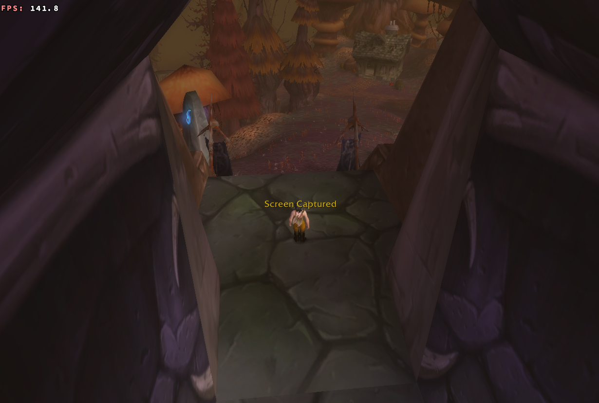
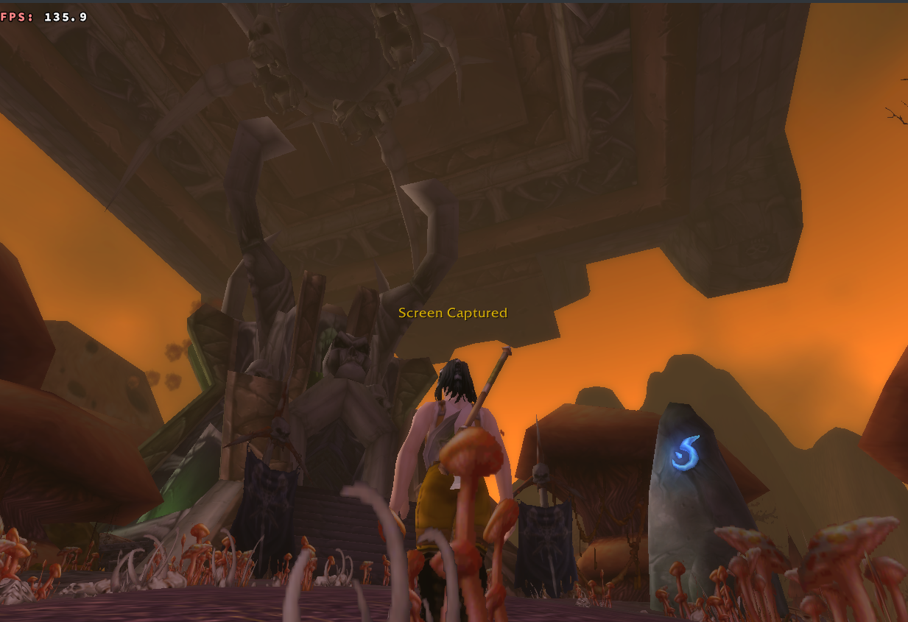
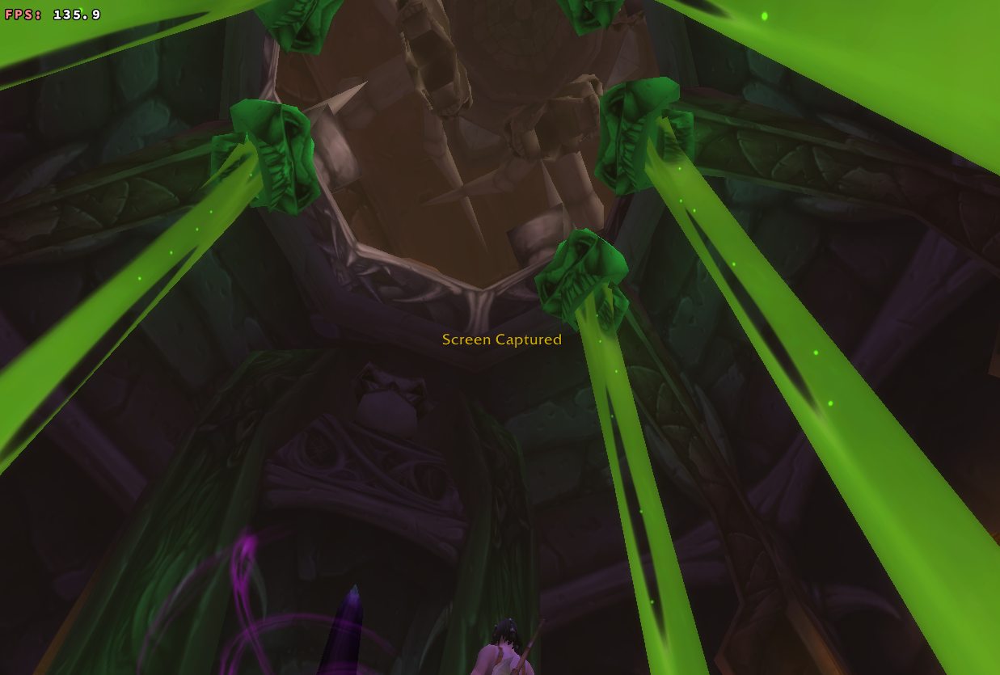
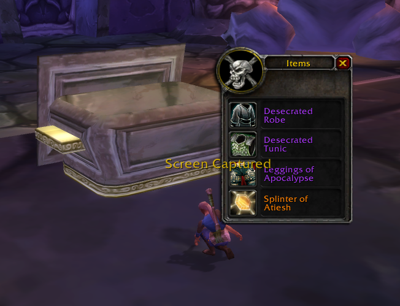
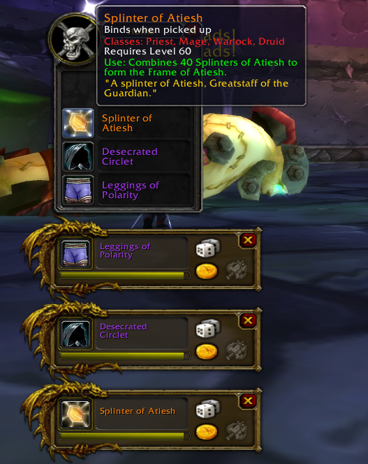

# Scaling lvl80 Naxx25 to lvl60 Naxx25

Also see AutoBalance fork https://github.com/SoglaHash/mod-autobalance-naxx25-60/tree/naxx

A video (WIP). See more details below


https://user-images.githubusercontent.com/74299960/183513127-17bd96f6-fac9-44a2-be0c-d2eacf6ec15e.mp4


Progress:
- [x] Allow lvl 60 to enter
- [x] Add floating Naxx (need to move away outside Plaguewood for it to load)
- [x] Exit portals TP to EPL
- [x] Scale instance with autobalancer (can be tuned easily)
- [x] Naxx25 mechanics
- [x] Change graveyard to EPL
- [x] Add summoning stone to EPL
- [x] Add Teleport gameobject in EPL
- [x] Integrate scaling script in this repo (v1.2.2-clean-up-old-code from [mod-autobalance-naxx25-60](https://github.com/SoglaHash/mod-autobalance-naxx25-60/tree/naxx)
- [x] Add enter spell (ID: 29296) when entering Naxx (need to overwrite instance OnPlayerEntered)
- [ ] Update Boss Loot to lvl60 (WIP: Thaddius, 4H, Patchwerk complete)
- [ ] Update Trash Loot to lvl60
- [ ] Add quests to turn in tokens
- [ ] Add Frozen Rune game objects
- [ ] Add frost resistance recipes
- [ ] Add frost resistance anvil (gobject)
- [ ] Add Attunement quest requirement
Skipping (for now):
- [ ] Scourge event
- [ ] Accurate Naxx40 mechanics


25man mechanics (using 25man map)

Exit portal to EPl

Floating naxx object

transporter naxx object

transporter naxx object2

Chest loot

Thaddius loot


Summary of multiple approaches
## 1 Select and Update ❌
Scale level and hp to appropriate level with SELECT
and UPDATE statements

PROS: EZ

CONS: Data value of spells is not changed

## 2 Autobalancer  ✅ ❔
Set scaling with autobalancer script.
Only autobalance creatures in Naxxramas (mapID: 533)

PROS: Scales all damage and can be tuned with global modifiers
CONS: Hooks apply to all maps and creatures.
Applies scaling of 1.0f to 99.99% of all combat interactions.

EZ to tune with config
```
AutoBalance.rate.global = 1.0
AutoBalance.rate.health = 1.0
AutoBalance.rate.mana   = 1.0
AutoBalance.rate.armor  = 1.0
AutoBalance.rate.damage = 1.0
```
## 3 Dump and Scale  ❔

Use data from autobalancer to scale only Naxx25 mobs.

1. dump out all the stats set by autobalancer
2. apply scaling script only to creatures in Naxx.

PROS: Accurate scaling with low overhead

CONS: more work

## 4 Custom Map

PROS: Allows lvl 80 Naxx AND lvl 60 Naxx to co-exist

CONS: even more work

# Data
some data of Naxx25

## Select non-bosses 
select spawned on map 533
```
SELECT DISTINCT creature_template.entry, creature_template.difficulty_entry_1, creature_template.name FROM creature_template, creature WHERE creature_template.rank != 3 AND creature.map = 533 AND creature_template.entry = acore_world.creature.id1 AND creature_template.minlevel > 21;
```


ID1 of non-bosses
```
15974, 15975, 15976, 15977, 15978, 15979, 15980, 15981, 16017, 16018, 16020, 16021, 16022, 16024, 16025, 16029, 16034, 16036, 16037, 16056, 16057, 16067, 16082, 16145, 16146, 16154, 16156, 16163, 16164, 16165, 16167, 16168, 16193, 16194, 16215, 16216, 16236, 16243, 16244, 16297, 16400, 16447, 16980, 29912, 30071, 30083, 30085,

16027, 16573, 16698, 16505, 16506, 17055, 16290, 16984, 16983, 16981, 16982, 16803, 16125, 16126, 16124, 16150, 16149, 16148, 23561, 23563, 23562, 16441, 16286, 16127, 16360
```

|entry|difficulty_entry_1|name|
|-----|------------------|----|
|15974|29242|Dread Creeper|
|15975|29241|Carrion Spinner|
|15976|29243|Venom Stalker|
|15977|29229|Poisonous Skitterer|
|15978|30389|Crypt Reaver|
|15979|29286|Tomb Horror|
|15980|29247|Naxxramas Cultist|
|15981|29248|Naxxramas Acolyte|
|16017|29347|Patchwork Golem|
|16018|29353|Bile Retcher|
|16020|29362|Mad Scientist|
|16021|29359|Living Monstrosity|
|16022|29363|Surgical Assistant|
|16024|29355|Embalming Slime|
|16025|29371|Stitched Giant|
|16029|29356|Sludge Belcher|
|16034|29609|Plague Beast|
|16036|29608|Frenzied Bat|
|16037|29603|Plagued Bat|
|16056|29612|Diseased Maggot|
|16057|31542|Rotting Maggot|
|16067|29852|Deathcharger Steed|
|16082|0|Naxxramas Trigger|
|16145|29824|Death Knight Captain|
|16146|29823|Death Knight|
|16154|29831|Risen Squire|
|16156|29833|Dark Touched Warrior|
|16163|29842|Death Knight Cavalier|
|16164|29825|Shade of Naxxramas|
|16165|29828|Necro Knight|
|16167|29835|Bony Construct|
|16168|29576|Stoneskin Gargoyle|
|16193|29837|Skeletal Smith|
|16194|29898|Unholy Axe|
|16215|29899|Unholy Staff|
|16216|29900|Unholy Swords|
|16236|29613|Eye Stalk|
|16243|29575|Plague Slime|
|16244|29574|Infectious Ghoul|
|16297|29601|Mutated Grub|
|16400|0|Toxic Tunnel|
|16447|30097|Plagued Ghoul|
|16980|0|The Lich King|
|29912|0|Obedience Crystal|
|30071|30075|Stitched Colossus|
|30083|30424|Marauding Geist|
|30085|30087|Vigilant Shade|


select present but not set in map 533
```
SELECT DISTINCT creature_template.entry, creature_template.difficulty_entry_1, creature_template.name FROM creature_template, creature WHERE creature_template.entry IN (16803, 16505, 16506, 17055, 16027, 16290, 16360, 16981, 16982, 16983, 16984, 16286, 23561, 23562, 23563, 16441, 16124, 16125, 16126, 16127, 16148, 16149, 16150, 16573, 16698);
```
|entry|difficulty_entry_1|name|
|-----|------------------|----|
|16027|0|Living Poison|
|16573|29256|Crypt Guard|
|16698|29267|Corpse Scarab|
|16505|29273|Naxxramas Follower|
|16506|29274|Naxxramas Worshipper|
|17055|29279|Maexxna Spiderling|
|16290|29388|Fallout Slime|
|16984|29632|Plagued Warrior|
|16983|29633|Plagued Champion|
|16981|29634|Plagued Guardian|
|16982|29635|Plagued Construct|
|16803|29941|Death Knight Understudy|
|16125|29985|Unrelenting Death Knight|
|16126|29986|Unrelenting Rider|
|16124|29987|Unrelenting Trainee|
|16150|29988|Spectral Rider|
|16149|29989|Spectral Horse|
|16148|29990|Spectral Death Knight|
|23561|30016|Soldier of the Frozen Wastes|
|23563|30047|Soul Weaver|
|23562|30049|Unstoppable Abomination|
|16441|30057|Guardian of Icecrown|
|16286|30068|Spore|
|16127|30264|Spectral Trainee|
|16360|30303|Zombie Chow|


`difficulty_entry_1` of non-bosses
```
(29356, 29824, 29823, 29831, 29833, 29842, 29825, 29828, 29835, 29576, 30097, 29837, 29898, 29899, 29900, 29242, 29241, 29243, 29229, 30389, 29286, 29247, 29613, 29248, 29575, 29574, 30075, 30087, 29347, 29353, 29362, 29359, 29363, 29355, 29371, 29609, 29608, 29603, 29601, 29612, 31542, 29852, 30424)
```

`difficulty_entry_1` of non-bosses that are spawned
```
(30047, 30049, 30016, 29279, 29632, 29633, 29635, 29634, 29941, 29267, 29256, 29274, 29273, 30057, 30303, 29388, 30068, 29988, 29989, 29990, 30264, 29986, 29985, 29987)
```

## Select bosses
```
SELECT DISTINCT creature_template.entry, creature_template.difficulty_entry_1, creature_template.name FROM creature_template, creature WHERE creature_template.rank = 3 AND creature.map = 533 AND creature_template.entry = acore_world.creature.id1 AND creature_template.minlevel > 21;
```
|entry|difficulty_entry_1|name|
|-----|------------------|----|
|15931|29373|Grobbulus|
|15932|29417|Gluth|
|15936|29701|Heigan the Unclean|
|15953|29268|Grand Widow Faerlina|
|15954|29615|Noth the Plaguebringer|
|15956|29249|Anub'Rekhan|
|16011|29718|Loatheb|
|16028|29324|Patchwerk|
|16060|29955|Gothik the Harvester|
|16061|29940|Instructor Razuvious|
|15928|29448|Thaddius|
|15952|29278|Maexxna|
|16064|30603|Thane Korth'azz|
|16065|30601|Lady Blaumeux|
|30549|30600|Baron Rivendare|
|16063|30602|Sir Zeliek|
|15989|29991|Sapphiron|
|15990|30061|Kel'Thuzad|

`difficulty_entry_1` of bosses
```
(29373, 29417, 29701, 29268, 29615, 29249, 29718, 29324, 29955, 29940, 29448, 29278, 30603, 30601, 30600, 30602, 29991, 30061)
```

## Comparing mobs acore vs brotalnia db
Select mobs from acore
```
SELECT DISTINCT creature_template.* FROM creature_template, creature WHERE creature.map = 533 AND creature_template.entry = acore_world.creature.id1 AND creature_template.minlevel > 21 AND creature_temp    late.entry != 16980;
 ```

Select mobs  from brotalnia
```
SELECT DISTINCT creature_template.entry FROM creature_template, creature WHERE creature.map = 533 AND creature_template.entry = creature.id
```

Select health from acore
```
SELECT DISTINCT creature_template.entry,creature_template.name, creature_template.entry, creature_template.HealthModifier FROM creature_template, creature WHERE creature.map = 533 AND creature_template.entry = acore_world.creature.id1 AND creature_template.minlevel > 21;
 ```

Select health from brotalnia
```
SELECT DISTINCT creature_template.entry, creature_template.armor, creature_template.dmg_min, creature_template.dmg_max, creature_template.name, creature_template.health_min, creature_template.health_max FROM creature_template, creature WHERE creature.map = 533 AND creature_template.entry = creature.id
```

# Approach 1 details
## Scaling

 Scale trash level health modifier with 1.5
```
UPDATE creature_template SET HealthModifier = HealthModifier * 1.5   WHERE entry IN ();
```
 Scale level
```
UPDATE creature_template SET minlevel = (minlevel - 20)   WHERE entry IN ();
UPDATE creature_template SET maxlevel = (maxlevel - 20)   WHERE entry IN ();
```
Values observed of Naxx10
| Creature | Brotalnia (nax40) | AzerothCore Naxx10 (scaled to lvl60) | modifier| health (pre scaling)|
|--|--|--|--|--|
|Skitterer|15720|10316|2|
|Venom Stalker|94320|61896|12|
|Noth the Plaguebringer|1665500|884400|200|2789000
|Frenzied Bat|10682|7469|1.5|
|Patchwork Golem|88032|56738|11|143000
|Embalming Slime|12208|7967|1.6|20000
|Patchwork|3997200|1713370|310|432200

To set values to Naxx40 levels:
Bosses modifiers x2
Non-bosses modifers x1.5
To scale it to Naxx25 lvl60, scale by x0.5
Conclusion: No scaling needed for HP values after scaling to lvl60

Issue: Spells need scaling

## Approach 2 Details
Naxx25 scaling observed with linear scaling factor X

| Creature |	Naxx40 (Brotalnia) |	AutoBalance (X=1.0) |
|--|--|--|
|Skitterer	|15720|15721|
|Venom Stalker	|94320| 94321	|
|Noth the Plaguebringer|	1665500| 1612000	|
|Frenzied Bat|	10682| 9157	|
|Patchwork Golem|	88032| 94321	| 
|Embalming Slime|	12208| 12209	|
|Patchwork|	3997200| 3114000 	|

## Approach 3 Details
Armor, hp, mana can be set with select/update statements as in Approach 1

Mechanics stay the same

Spell damage values need to be changed
### Spells
Grab Wrath Spells
We have a list of creatures in Naxx
look up their smart ai scripts
lookup the spells, then open spellDBC 
https://github.com/wowgaming/node-dbc-reader

Grab Brotalnia 1.12 Spells
check IDs and damage

create update/select query to scale

Scale
Venom Stalker
15976 29243
Poison Charge

## Approach 4 Details
create custom patch

edit the map to spawn naxx in EPL incl portal

custom spells (copy of naxx25 values) and scale those to lvl60

custom map area

# Loot
Trash loot:
LootID in Creature_Template

100003

4H Chest

Deathknight Wing Eye Portal Boss

GUID 65854

ID 181230

Damnation 

40348

gameobject_loot_template 

Entry=25193

reference_loot_template

Reference 34382

Reference 34146


brotalnia chest gameobject_loot_template

entry=181366

reference 12002 for tokens

reference_loot_template

token 22349


Thaddius loot example found in brotalnia

```
creature_template
    entry 15928
    loot_id 15928
creature_loot_template
    Entry loot_id 15928
    22726 (atiesh)
    30450 ref
       reference_loot_template 
       22353
       22360
       22367
    30451 ref
       22353
       22360
       22367
    30452 ref
       reference_loot_template 
       22801
       22808
       23000
       23001
       23070
```

## Brotalnia data
https://github.com/brotalnia/database
`world_full_14_june_2021.7z`

I setup a stack with Portainer and imported the data. 

Setup a `uploads.ini` (see below) to increase upload size. Go to localhost:8090 and upload SQL to import data.

docker-compose
```
# Use root/example as user/password credentials
version: '3.1'

services:
  db:
    image: mysql
    # NOTE: use of "mysql_native_password" is not recommended: https://dev.mysql.com/doc/refman/8.0/en/upgrading-from-previous-series.html#upgrade-caching-sha2-password
    # (this is just an example, not intended to be a production configuration)
    command: --default-authentication-plugin=mysql_native_password
    restart: always
    environment:
      MYSQL_ROOT_PASSWORD: password
    ports:
      - '3305:3306'

  adminer:
    image: adminer
    restart: always
    volumes:
       - /home/${USER}/scripts/uploads.ini:/usr/local/etc/php/conf.d/uploads.ini
    ports:
      - 8090:8080
```
```
$ cat uploads.ini
file_uploads = On
upload_max_filesize = 256M
post_max_size = 256M
```

## Entrance Difficulty
By default it'll enter Naxx10 (difficulty: 0) which makes things complicated as
we want 25man mechanics.

Need to run `/script SetRaidDifficulty(2)` ingame to set difficulty to 25m

## How to teleport to naxx?
item on use:
    https://github.com/azerothcore/mod-pocket-portal
    PROS: neat, more lore friendly
    CONS: more difficult to implement
Set epic, itemlvl, turn off boa

portal NPC in Lights Hope:
    https://github.com/Zoidwaffle/sql-npc-teleporter
    PRO: easy
    CONS: boring

Orb that teles from Sapphiron to Naxx
ID GUID
202278 268048

29295 Tele DND -> does nothing
72613 -> teles to Sapphiron (exit) 
72617 Spphiron Entry: Teles to naxxramas

just add the gameobject to EPL

.gobject add 181599 blue rune // purple 181600
icy rune
186747
or frozen rune
181287 
blue rune 182591 (wall) or 182590 ground
necro rune stone
189314
rune
188695
Scourge transporter rune

Overwrite Instance Naxx somehow
```
void OnPlayerEnter(Player* player) override
{
    player->CastSpell(player, 29296, true);
}
```

## Some commands

set 25man difficulty
```
/script SetRaidDifficulty(2)
```

reset instance
```
.instance unbount all
```
go Thaddius
```
.go c 130957
```
4H door
```
.gobject activate 65753
.go c 130961
```
patchwerk
```
.go c 128135
```

Naxx cauldron
```
.go xyz 3124 -3732 134
```


# Azerothcore Progression System Module

This is progression system module for AzerothCore!

It allows to load scripts and sql files automatically dependent on level brackets. It means that once you defined in config which level brackets should be present, all c++ scripts from these brackets are loaded and replaced with "normal" scripts in AzerothCore.

</br>
</br>
CONFIG

[Here](https://github.com/UltraNix/mod_progression-system/blob/master/conf/progression_system.conf.dist#L34) you can set which level brackets should be loaded. It'a bitmask, so you can set here multiple brackets to be loaded. [Allowed brackets masks](https://github.com/UltraNix/mod_progression-system/blob/master/src/ProgressionSystem.h#L11)

E.g. If you set 64, it means that scripts/sql files from level 50-59 - Tier B will be loaded. If you set 127, then all level brackets up to level 60 Tier 1. 0 means nothing - none of the scripts/sqls will be loaded.

</br>
</br>
<b>SQL FILES</b>
</br>
SQL files can be loaded to your databse once you have enabled auto DB updater in your worldserver config. All sql files should be put in proper folder in order to be loaded within specific level bracket. E.g. sqls related to bracket 40-49 should be put into https://github.com/UltraNix/mod_progression-system/tree/master/src/Bracket_40_49/sql/world
</br>
WARNING: SQL files once executed cannot be "unloaded". E.g. if you set in config 30-39 level bracket, then all sql files related to it will be loaded. But if you change your mind and set that config to 20-29 bracket, then the sql files from bracket 30-39 are still in your database and works. If you want to undo the changes done in these sql files, just make a new one sql file and restore the previous state.

</br>
</br>
</br>
<b>C++ SCRIPTS</b>
</br>
C++ scripts can also be automatically loaded dependent on bracket level. All you need to do, is to copy and paste C++ script you want to modify to proper folder, change whatever you want within and just create a new script loader function. <b>You don't need to change your script's name in database nor your C++ script's name (only script object name)</b>.
[Here](https://github.com/UltraNix/mod_progression-system/commit/aad916bbe068f28ce769d028f138f434ba4655a8) is the example how to do it.

</br>
</br>
2 notes:
</br>
1. Your custom script must renamed to something slightly different, otherwise core will still load old script. Preferable: <code>xxx_yy</code>, where <code>xxx</code> is the name of old script and <code>yy</code> is the name of bracket, e.g. <code>boss_drakkisath</code> renamed to <code>boss_drakkisath_50_59_b</code>. Also, scripts loader function (<code>AddSC_xxx</code>) must be renamed accordingly, e.g. <code>AddSC_boss_drakkisath</code> renamed to <code>AddSC_boss_drakkisath_50_59_b</code>.
</br>
2. Don't forget to include that scripts loader function (<code>AddSC_xxx</code>) in bracket loader. E.g. <code>AddSC_boss_drakkisath_50_59_b</code> holds scripts related to bracket 50-59, it should be declared and defined in <code>Bracket_50_59_B_loader.cpp</code> (https://github.com/azerothcore/mod-progression-system/blob/NewModule/src/Bracket_50_59_B/Bracket_50_59_B_loader.cpp)

</br>
</br>
WARNING: If you are applying some changes to main script (in AzerothCore) and they are independent from the level bracket, you should apply these changes to your progressive script as well.
